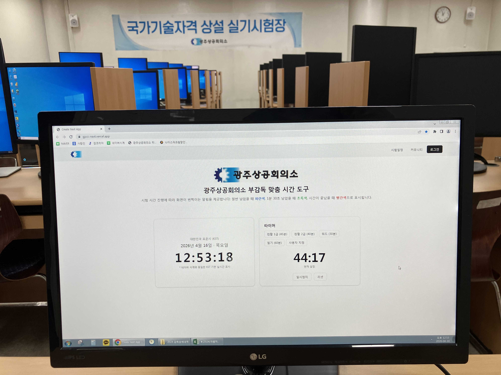
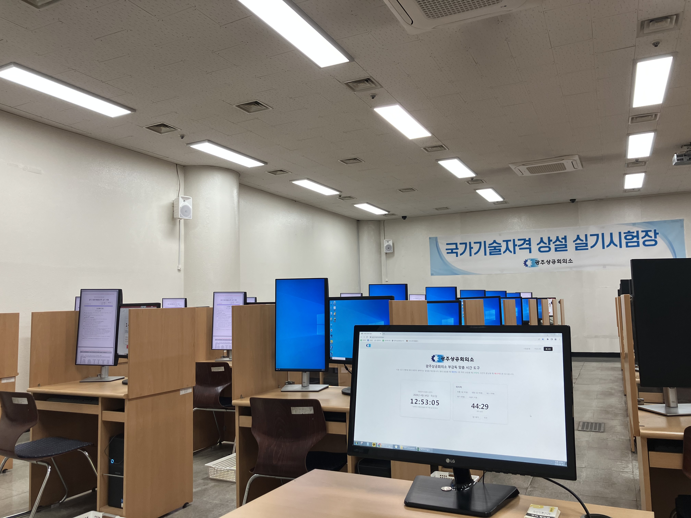
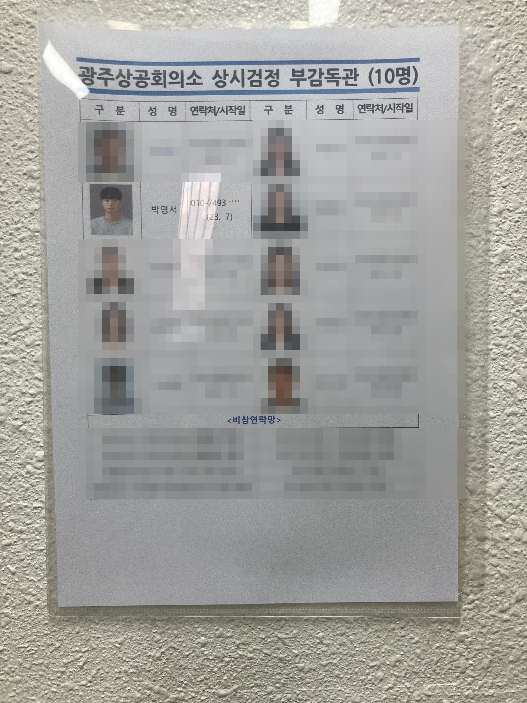

# GJCCI-NEXT · 광주상공회의소 부감독 지원 시스템

> 광주상공회의소 국가기술자격 상설 실기시험장의 **부감독관**을 위한 시험 진행 보조 · 소통 커뮤니티 웹 애플리케이션

[](https://nextjs.org/)
[](https://react.dev/)
[](https://www.typescriptlang.org/)
[](https://supabase.com/)
[](https://tailwindcss.com/)

배포: **https://gjcci-next.vercel.app**

---

## 프로젝트 배경 — 어떤 문제를 풀었는가

광주상공회의소는 국가기술자격 **상설 실기시험장**을 운영하며, 각 시험 회차마다 여러 명의 **부감독관**이 배치되어 정감독을 보조합니다. 실제 시험 운영 현장에서는 다음과 같은 반복적인 불편이 있었습니다.

- **시간 관리의 어려움** — 컴퓨터활용능력 1급(45분)·2급(40분), 워드프로세서(30분), 필기(60분) 등 종목마다 시험 시간이 다릅니다. 부감독은 개인 시계나 스마트폰으로 종료 시각을 매번 암산·확인해야 했고, 잔여 시간을 놓치기 쉬웠습니다.
- **기준 시각의 불일치** — 시험 시작/종료는 정확한 표준시(KST) 기준으로 이루어져야 하는데, 감독별로 참고하는 시계가 달라 오차가 발생할 여지가 있었습니다.
- **감독 간 소통의 단절** — 정감독과 부감독, 그리고 필기/실기 시험장 사이의 실시간 연락 수단이 마땅치 않았습니다. 돌발 상황(응시자 문의, 장비 문제, 시간 조정 등) 발생 시 즉시 공유하기 어려웠습니다.
- **정보 공유의 부재** — 시험 일정, 유의사항, 운영 중 발견한 오류 등을 부감독끼리 축적·공유할 공간이 없었습니다.

**GJCCI-NEXT**는 부감독 자리의 시험장 PC에서 브라우저로 바로 띄워, 위 문제들을 한 화면에서 해결하도록 만든 도구입니다.

## 실제 운영 활용

본 서비스는 **광주상공회의소 상설 실기시험장에서 실제로 활용 중**입니다. 부감독 좌석에 배치된 시험장 PC의 브라우저에서 상시 실행되며, 시험 진행 중 타이머·시계·감독 채팅 용도로 사용됩니다.

| 시험장 PC에서 실행 중인 화면 | 부감독 좌석에서의 사용 모습 |
| :---: | :---: |
|  |  |

### 근무 이력

본 프로젝트 제작자는 광주상공회의소 상시검정 **부감독관**으로 실제 근무하였습니다. 아래는 시험장에 게시된 **상시검정 부감독관 명단**으로, 제작자(박영서, 2023.7~)가 부감독으로 등재되어 있습니다.

> 개인정보 보호를 위해 **본인 외 다른 부감독관의 정보는 모두 모자이크** 처리했으며, **본인 연락처 또한 일부(뒤 4자리)를 마스킹**했습니다.

<p align="center">
  
</p>

---

## 주요 기능

### 1. 종목별 시험 타이머

- 종목 프리셋 제공: **컴활 1급(45분)** · **컴활 2급(40분)** · **워드(30분)** · **필기(60분)**, 그리고 **사용자 지정** 시간 입력(`25`, `10:00`, `1:30` 형식 파싱).
- 시작 / **일시정지** / **리셋** 제어.
- **정밀도 보정** — 매초 감산 방식이 아니라 **종료 시각(deadline) 기준** 계산 방식을 사용합니다. 시작 시 `Date.now() + 남은시간` 을 종료 시각으로 고정하고 500ms마다 남은 시간을 재계산하며, 탭 `visibilitychange` 시에도 재동기화하여 백그라운드 스로틀링으로 인한 오차를 방지합니다.
- **시각적 알림(화면 점멸)** — 시험 진행 상황을 색으로 알립니다.
  - 절반 남았을 때 → <kbd>파란색</kbd>
  - 1분 30초 남았을 때 → <kbd>초록색</kbd>
  - 시간이 끝났을 때 → <kbd>빨간색</kbd> (+ 종료 비프음, 브라우저 알림 권한 시 알림 표시)

구현: [`hooks/useTimer.ts`](hooks/useTimer.ts), [`components/home/TimerCard.tsx`](components/home/TimerCard.tsx)

### 2. KST 실시간 시계

- `Intl.DateTimeFormat("ko-KR", { timeZone: "Asia/Seoul" })` 기반으로 **대한민국 표준시(KST)** 를 초 단위로 표시합니다.
- 시험 시작/종료 기준 시각을 감독이 일관되게 확인할 수 있도록, 날짜·요일·시각을 크게 노출합니다.
- 표시 시각은 접속 기기의 시계를 KST 타임존으로 변환한 값입니다.

구현: [`components/home/NaverLikeClock.tsx`](components/home/NaverLikeClock.tsx)

### 3. 감독관 실시간 채팅 위젯

정감독 ↔ 부감독, 필기 ↔ 실기 시험장 간 **실시간 소통**을 위한 플로팅 채팅 위젯입니다. 모든 페이지 우측 하단에 상주합니다.

- **로그인 없이** 즉시 사용 가능 — 참여 시 **구분(필기/실기)** 과 **역할(정감독/부감독)** 을 선택하며, 메시지에 `필기 · 부감독` 형태의 라벨이 함께 표시됩니다.
- **Supabase Realtime**(Broadcast + Presence) 채널(`proctor-chat`)로 동작하며, 현재 접속 인원 수를 실시간 표시합니다.
- 메시지별 **전송 시각(HH:MM)** 표시, 새 메시지 도착 시 비프음/안읽음 배지 알림.
- 참여자는 자신의 **구분·역할을 언제든 수정** 가능합니다.
- 메시지는 브로드캐스트 방식으로 실시간 공유되며 별도 DB에 저장하지 않는 **휘발성** 구조입니다(새로고침 시 이전 대화는 남지 않음).

구현: [`components/chat/ChatWidget.tsx`](components/chat/ChatWidget.tsx)

### 4. 부감독 커뮤니티 게시판 (`/community`)

- 카테고리: **공지 / 자유 / 오류**(+ 전체 보기).
- 게시글 작성·삭제, **익명 작성** 지원, 페이지네이션(5건/페이지).
- 작성 시 **낙관적 업데이트(optimistic update)** 와 zod 유효성 검증 적용. 삭제는 작성자 본인에게만 노출.
- 상대 시간("n분 전") 표기.

구현: [`app/community/page.tsx`](app/community/page.tsx), [`components/community/`](components/community/), [`lib/supabase/posts.ts`](lib/supabase/posts.ts)

### 5. 시험 일정 공유 (`/exam-schedule`)

- 시험 일정 이미지를 **Supabase Storage**에 업로드/조회하며, 기간(from~to)별로 관리합니다.

구현: [`app/exam-schedule/page.tsx`](app/exam-schedule/page.tsx)

### 6. 인증 및 관리자 승인 (`/login`, `/signup`, `/admin`)

- **NextAuth v5(Credentials)** + **Supabase Auth** 기반 로그인/회원가입.
- 회원가입 시 역할(정감독/부감독)을 선택하며, 신규 계정은 **승인 대기(pending)** 상태로 생성됩니다.
- **관리자 승인 플로우** — 관리자가 `/admin`에서 사용자 **승인/거절/역할 변경/삭제**를 수행하며, 승인된(`approved`) 사용자만 로그인 가능합니다.
- 라우트 접근 제어는 Next.js 16의 `proxy.ts`(구 middleware)에서 `guestOnly` / `authOnly` / `adminOnly` 규칙으로 처리합니다.

구현: [`auth.ts`](auth.ts), [`auth.config.ts`](auth.config.ts), [`proxy.ts`](proxy.ts), [`app/admin/`](app/admin/)

---

## 기술 스택

| 영역 | 사용 기술 |
| --- | --- |
| 프레임워크 | Next.js 16 (App Router, RSC), React 19, TypeScript 5 |
| 스타일링 | Tailwind CSS v4, shadcn/ui(new-york) · Radix UI, lucide-react |
| 백엔드/인프라 | Supabase — Auth · Realtime · Storage (`@supabase/ssr`, `@supabase/supabase-js`) |
| 인증 | NextAuth v5 (beta, Credentials) |
| 폼/검증 | react-hook-form, zod, `@hookform/resolvers` |
| 상태/UX | sonner(토스트), next-themes, react-day-picker |
| 날짜 | date-fns, dayjs |

---

## 프로젝트 구조

```
app/                # App Router 라우트 · 페이지 · 서버 액션
  ├─ page.tsx          # 홈: KST 시계 + 타이머
  ├─ community/        # 커뮤니티 게시판
  ├─ exam-schedule/    # 시험 일정 (Supabase Storage)
  ├─ admin/            # 관리자 사용자 관리(승인/거절/역할)
  ├─ my-profile/       # 내 프로필
  ├─ login/ · signup/  # 인증
  └─ api/auth/         # NextAuth 라우트 핸들러
components/
  ├─ chat/             # 감독관 실시간 채팅 위젯
  ├─ home/             # 시계 · 타이머 · Hero
  ├─ community/        # 게시판 UI · hook · schema
  ├─ exam-schedule/    # 일정 업로더
  └─ ui/               # shadcn/ui 프리미티브
hooks/useTimer.ts      # 타이머 로직
lib/ · utils/          # Supabase 클라이언트, 인증 유틸, 정의
constants/             # 라우트 규칙 · 상수
```

---

## 로컬 실행

> 패키지 매니저: **pnpm** (`pnpm-lock.yaml`)

```bash
pnpm install
pnpm dev      # 개발 서버 (http://localhost:3000)
pnpm build    # 프로덕션 빌드
pnpm start    # 프로덕션 실행
pnpm lint     # ESLint
```

### 환경 변수

`.env.local`에 다음 값을 설정합니다.

```bash
NEXT_PUBLIC_SUPABASE_URL=              # Supabase 프로젝트 URL
NEXT_PUBLIC_SUPABASE_PUBLISHABLE_KEY=  # Supabase publishable(anon) 키
NEXT_PUBLIC_STORAGE_BUCKET=            # 시험 일정 이미지 Storage 버킷명
AUTH_SECRET=                           # NextAuth 시크릿
AUTH_TRUST_HOST=                       # NextAuth trust host
```

### Supabase 스키마 개요

- **`users`** — `id`(auth uuid), `name`, `email`, `role`(`admin` / `main_director` / `sub_director`), `status`(`pending` / `approved` / `rejected`)
- **`posts`** — `id`, `author_id`, `author_name`, `category`, `title`, `content`, `likes`, `comments`, `created_at`
- **Storage 버킷** — 시험 일정 이미지(`exam-images/{from}_{to}/schedule.{ext}` 경로)

---

## 라이선스 및 문의

광주상공회의소 상설 실기시험장 부감독 운영을 위해 제작된 내부 활용 프로젝트입니다.
